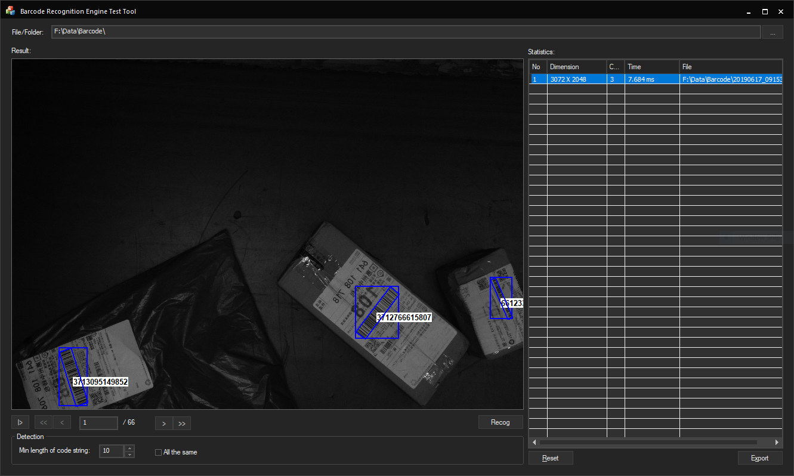
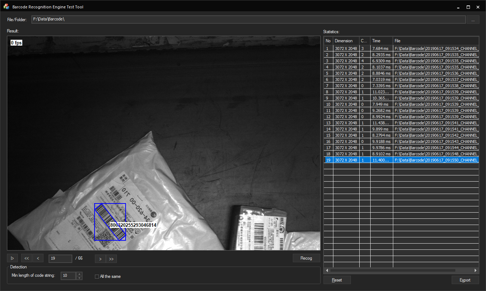
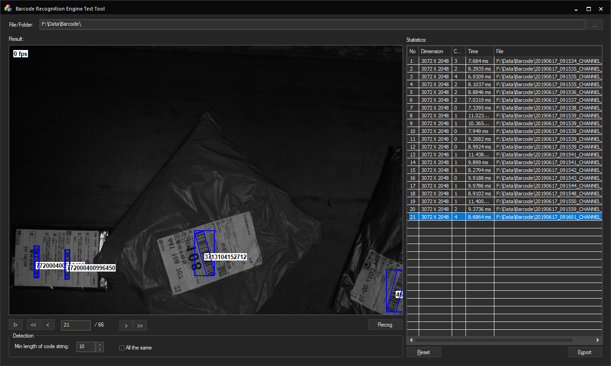
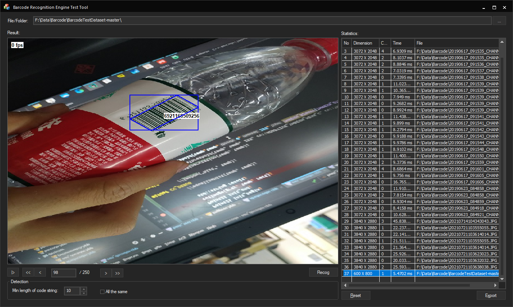
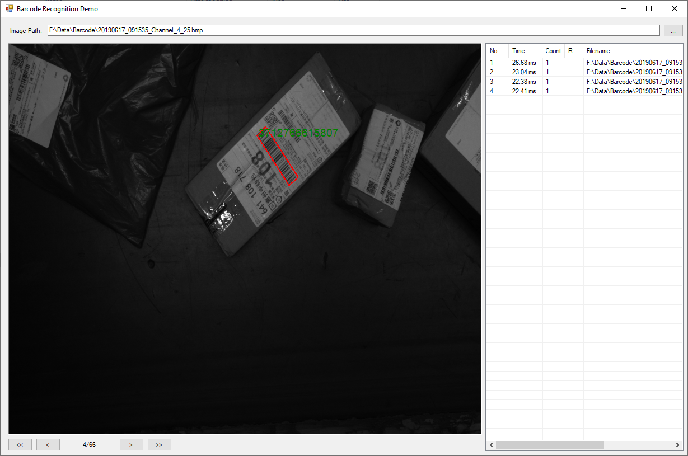
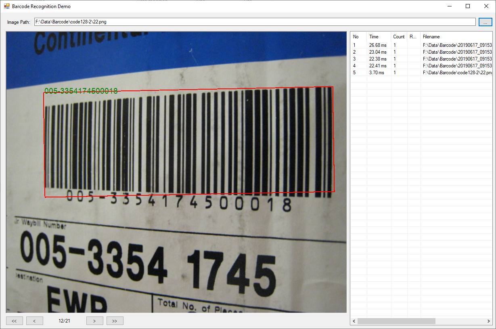

# MvTest

## Contents
MVTec HALCON is the comprehensive standard software for machine vision with an integrated development environment (HDevelop) that is used worldwide. It enables cost savings and improved time to market. HALCON’s flexible architecture facilitates rapid development of any kind of machine vision application.

MVTec HALCON provides outstanding performance and a comprehensive support of multi-core platforms, special instruction sets like AVX2 and NEON, as well as GPU acceleration. It serves all industries, with a library used in hundreds of thousands of installations in all areas of imaging like blob analysis, morphology, matching, measuring, and identification. The software provides the latest state-of-the-art machine vision technologies, such as comprehensive 3D vision and deep learning algorithms.

The software secures your investment by supporting a wide range of operating systems 

This project analyzes the barcode identification performance of Halcon.
Also provides examples of using Halcon in C# and C++.

## Versions
### Ver-0.1
Only barcode example
## Screenshot
### MFC App
 

### C#(Winform) App

## References
<a href = 'https://www.mvtec.com/products/halcon'>HALCON</a>

